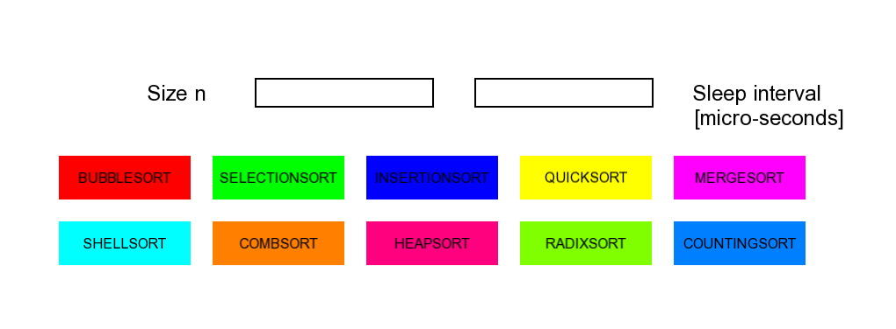
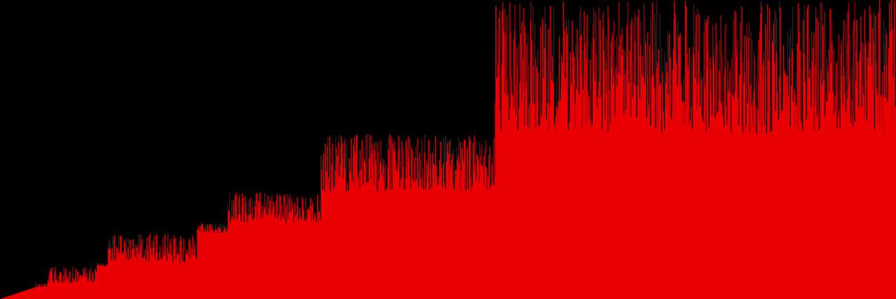

# SortVisualizer
SortVisualizer is a graphical program for visualizing sorting algorithms written in C++. It provides real-time, intuitive visualization of how different sorting algorithms work. The project leverages the SFML library for creating the graphical interface and animations.

## Features
The project incorporates a variety of sorting algorithms with customizable length and sort speed:

* Bubble Sort

* Quick Sort

* Selection Sort
* Insertion Sort
* Merge Sort
* Shell Sort
* Comb Sort
* Heap Sort
* Radix Sort
* Counting Sort

Each algorithm is visualized in a unique, real-time animation.

## Dependencies
This project relies on the SFML library for creating a graphical user interface and handling animations. Ensure you have SFML installed on your system before building the project.